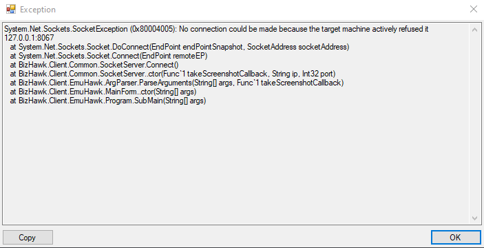

## TwitchControls
This project is intended to integrate twitch's irc chat with with the popular emulator [BizHawk](https://github.com/TASVideos/BizHawk/).

## Motivation
I want to make an all around program that lets twitch chat integrate directly with BizHawk for streamers to set up their own version of [Twitch Plays Pokemon](https://www.twitch.tv/twitchplayspokemon).

## Screenshots

## Tech

<b>Built With</b>
- [Node.js](https://nodejs.org/en/)
- [Lua](https://www.lua.org/)
- [BizHawk](https://github.com/TASVideos/BizHawk/)
- [tmi.js](https://tmijs.com/)

## Features 
- Integration between twitch chat and BizHawk
- Multi-User Support
- Input Buffering
- Input Voting

## Installation
### prerequisites
- Install the newest version of [node.js](https://nodejs.org/en/download/)
- Open the node command prompt 

- Navigate to the unpacked file location using the cd command
- Example: `cd user/desktop/TwitchControls`
- From here install the node modules with `npm install`

### BizHawk
- Download [Bizhawk](https://github.com/TASVideos/BizHawk/releases/)
- Unpack to desired location
- Open BizHawk and navigate to Tools->Lua Console
- In the top bar click settings
- MAKE SURE TO TURN ON DISABLE SCRIPTS ON LOAD
## Twitch Setup
- Navigate to TwitchControls->src->Javascript and edit the file `control.js`
- Change line 15 to your twitch channels username

- Save Changes
- The application will now connect to the channel that was defined
### Installation for NES/SNES/GBC
- Navigate to TwitchControls->src->Lua and copy the file `main.lua`
- In Bizhawk locate the folder labled lua
- Paste the `main.lua` to the Bizhawk lua folder
- Create a shortcut of the EmuHawk.exe
- Right click the shortcut and view it's properties
- In the target field append the following line `--socket_ip=127.0.0.1 --socket_port=8067 --luaconsole --lua=Lua/main.lua`

- Continued under `How to use`
### Installation for NES/SNES/GBC
- Navigate to TwitchControls->src->Lua and copy the file `mainGBA.lua`
- In Bizhawk locate the folder labled lua
- Paste the `mainGBA.lua` to the Bizhawk lua folder
- Create a shortcut of the EmuHawk.exe
- Right click the shortcut and view it's properties
- In the target field append the following line `--socket_ip=127.0.0.1 --socket_port=8067 --luaconsole --lua=Lua/mainGBA.lua`

- Continued under `How to use`
## How to use
- Once all the prerequisites have been configured it is time to launch the program
- Open a nodejs terminal in the javascript folder
- When the terminal is open launch the node server using the command `node control.js`
- If the server launches sucessfully there should be a blank line with no errors

- When and only when the nodejs server is running is it time to launch Bizhawk

- Navigate to the EmuHawk.exe shortcut you made in the earlier steps
- Launch the EmuHawk.exe shortcut
- If there is an error that looks like the following picture make sure the nodejs server is started

- Otherwise Bizhawk should launch and the lua console

- At this point load the rom of the game that you want played and click on the red box on the lua console to start the script
- If Everything is working a new message saying game starting should appear on the nodejs server window

- Congratulations everything is working!!!! Go play games with your twitch chat
- Commands are as following `!up !down !left !right !a !b !x !y !l !r !select !start`

## Contribute
- Please feel free to fork and modify this program as you see fit
- If you modify code please create a pull request and I will look at it as soon as possible
- If there are any errors that are encountered along the way feel free to open up an issue!

## Credits
Inspiration - [Twitch Plays Pokemon](https://www.twitch.tv/twitchplayspokemon)\
Project Developer - [Grant Porter](https://github.com/DrVario)

## License
Copyright 2020 Grant Porter

Permission is hereby granted, free of charge, to any person obtaining a copy of this software and associated documentation files (the "Software"), to deal in the Software without restriction, including without limitation the rights to use, copy, modify, merge, publish, distribute, sublicense, and/or sell copies of the Software, and to permit persons to whom the Software is furnished to do so, subject to the following conditions:

The above copyright notice and this permission notice shall be included in all copies or substantial portions of the Software.

THE SOFTWARE IS PROVIDED "AS IS", WITHOUT WARRANTY OF ANY KIND, EXPRESS OR IMPLIED, INCLUDING BUT NOT LIMITED TO THE WARRANTIES OF MERCHANTABILITY, FITNESS FOR A PARTICULAR PURPOSE AND NONINFRINGEMENT. IN NO EVENT SHALL THE AUTHORS OR COPYRIGHT HOLDERS BE LIABLE FOR ANY CLAIM, DAMAGES OR OTHER LIABILITY, WHETHER IN AN ACTION OF CONTRACT, TORT OR OTHERWISE, ARISING FROM, OUT OF OR IN CONNECTION WITH THE SOFTWARE OR THE USE OR OTHER DEALINGS IN THE SOFTWARE.

MIT © [Grant Porter](https://github.com/DrVario)